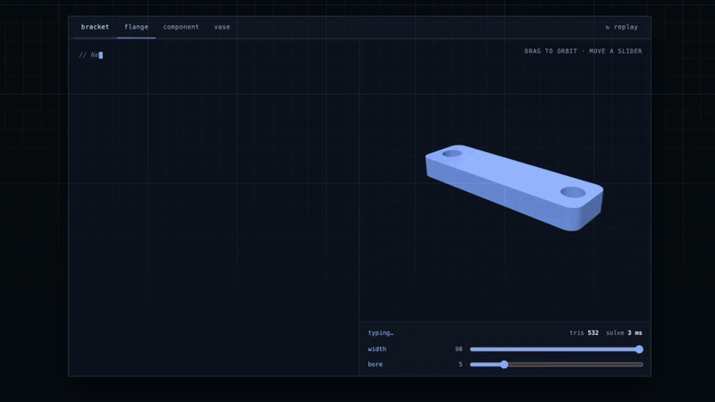
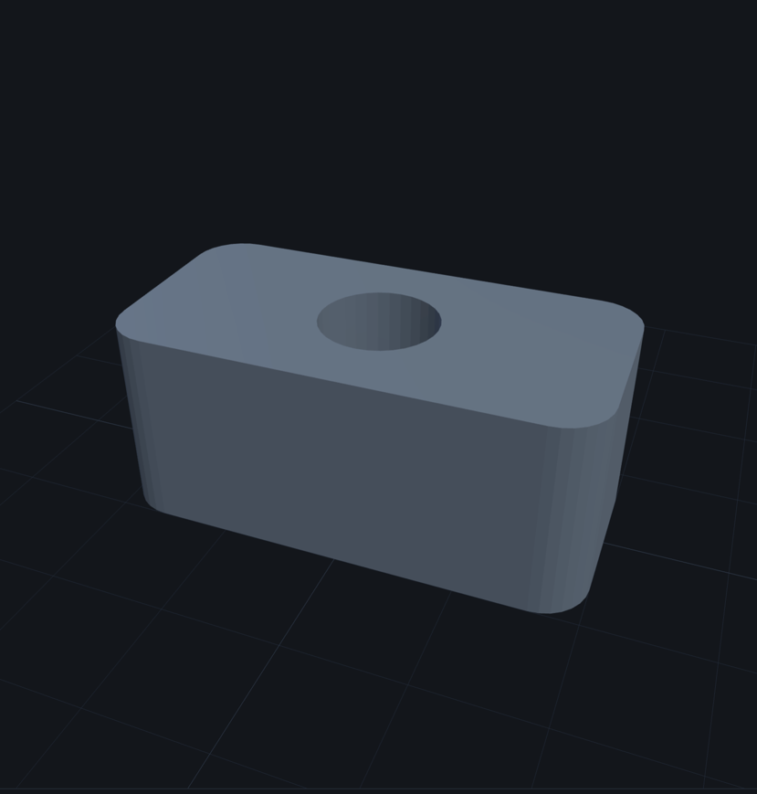

# forma-dsl

[](https://github.com/kalpak44/forma-dsl/actions/workflows/release.yml)
[](https://www.npmjs.com/package/forma-dsl)
[](https://www.npmjs.com/package/forma-dsl-mcp)

A declarative DSL for 3D modeling and scene composition, reusable components, and live
previews. This is the monorepo: the library, the editor that consumes it, and the reference
manual.

**[Try the editor](https://kalpak44.github.io/forma-dsl/editor/)** ·
**[Read the reference](https://kalpak44.github.io/forma-dsl/docs/)**



The [live demo](https://kalpak44.github.io/forma-dsl/#demo) types each document out and solves
it as it goes, then re-solves as a parameter moves — in the browser, with the same kernel.

```hcl
param height { type = number  default = 20  min = 8  max = 40 }

model "riser" {
  part "body" {
    color = "#6f7d8c"
    difference {
      extrude {
        height = var.height
        rounded_rect { size = [40, 20]  radius = 4  center = true }
      }
      translate { offset = [0, 0, 3]  cylinder { radius = 5  height = var.height } }
    }
  }
}
```



## Workspaces

| Package | Published | What it is |
| --- | --- | --- |
| [`packages/forma-dsl`](packages/forma-dsl) | [`forma-dsl`](https://www.npmjs.com/package/forma-dsl) | The language, its evaluator and the geometry kernel binding. One runtime dependency |
| [`packages/forma-dsl-mcp`](packages/forma-dsl-mcp) | [`forma-dsl-mcp`](https://www.npmjs.com/package/forma-dsl-mcp) | An MCP server over stdio: it knows the language, solves what it writes, and produces `.forma` files |
| [`apps/landing`](apps/landing) | no | The landing page: a live WebGL hero, a demo that types the language and solves it, and the privacy and terms sheets |
| [`apps/editor`](apps/editor) | no | The browser editor: CodeMirror, three.js, Vite |
| [`apps/docs`](apps/docs) | no | The reference manual, and the builder that renders it |

### How the pieces are kept honest

Every workspace here **depends on the published entry point**, not on the library's sources:
the editor imports `forma-dsl`, never `../../packages/forma-dsl/src`. An export one of them
needs and the package does not have therefore fails in this repository rather than in
someone's install.

The same rule governs what each workspace may *claim* about the language. None of them
restates the vocabulary — each reads it from the library's own registries, and a test holds
them to it:

- **Syntax highlighting is generated, not transcribed.** The editor's
  ([`language.js`](apps/editor/src/language.js)), the landing page's
  ([`highlight.js`](apps/landing/src/highlight.js)) and the manual's
  ([`build.mjs`](apps/docs/build.mjs)) all colour from `BLOCKS` and `FUNCTIONS`, so a block
  added to the language is highlighted without anyone updating a list.
- **Every example on the site renders.** The editor's four documents
  ([`examples.test.js`](apps/editor/test/examples.test.js)) and the landing page's demos
  ([`demos.test.js`](apps/landing/test/demos.test.js)) are solved by tests, so nothing shown
  being typed is a document the library can no longer build.
- **The MCP server's catalogue cannot drift.** It merges the registries into its own prose at
  load time and exposes any disagreement as `catalogueDrift`, which
  [`catalogue.test.js`](packages/forma-dsl-mcp/test/catalogue.test.js) asserts is empty. Its
  worked examples are rendered at both ends of every parameter's range.
- **The manual has no dead cross-references.** `npm run build` resolves all 237 internal links
  and fails rather than publishing a broken one.

## Working on it

Node 22.13 or newer — the floor the published packages declare.

```bash
npm ci
npm run check   # lint, typecheck, tests, build, package contents: the whole gate, same as CI
```

| Command | What it does |
| --- | --- |
| `npm run dev` | the landing page, with hot reload |
| `npm run dev:editor` | the editor |
| `npm run mcp` | the MCP server, on stdio |
| `npm test` | every workspace's tests |
| `npm run test:coverage` | the same, against the thresholds CI enforces |
| `npm run build` | the whole site into `dist/` |

[CONTRIBUTING.md](CONTRIBUTING.md) has the house style, the stability policy and how a release
is cut. [CHANGELOG.md](CHANGELOG.md) records what changed in each one.

Found something exploitable? [SECURITY.md](SECURITY.md) says where to send it — please not a
public issue.

## License

MIT — see [LICENSE](LICENSE).
